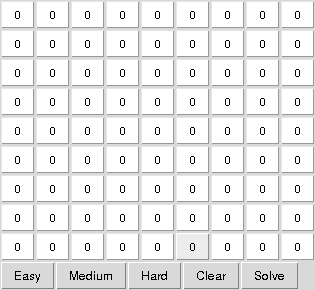

# sudoku-py

Sudoku solver written in Python utilizing backtracking. Includes a simple UI
using Tkinter.

### usage

For the text based version pass an 81 character string with 0-9 (zeros
represent an empty space) with `sudoku.py`, for example:

    $ python sudoku.py 094000130000000000000076002080010000032000000000200060000050400000008007006304008
    [[7, 9, 4, 5, 8, 2, 1, 3, 6],
     [2, 6, 8, 9, 3, 1, 7, 4, 5],
     [3, 1, 5, 4, 7, 6, 9, 8, 2],
     [6, 8, 9, 7, 1, 5, 3, 2, 4],
     [4, 3, 2, 8, 6, 9, 5, 7, 1],
     [1, 5, 7, 2, 4, 3, 8, 6, 9],
     [8, 2, 1, 6, 5, 7, 4, 9, 3],
     [9, 4, 3, 1, 2, 8, 6, 5, 7],
     [5, 7, 6, 3, 9, 4, 2, 1, 8]]

As you can see the resulting board is immediately appended afterwards.

For the UI, simply start it using `$ python ui.py`. The UI will immediately try
to load the two problem sets from `problems/`. You can of course load easy or
hard problem sets or create your own.

